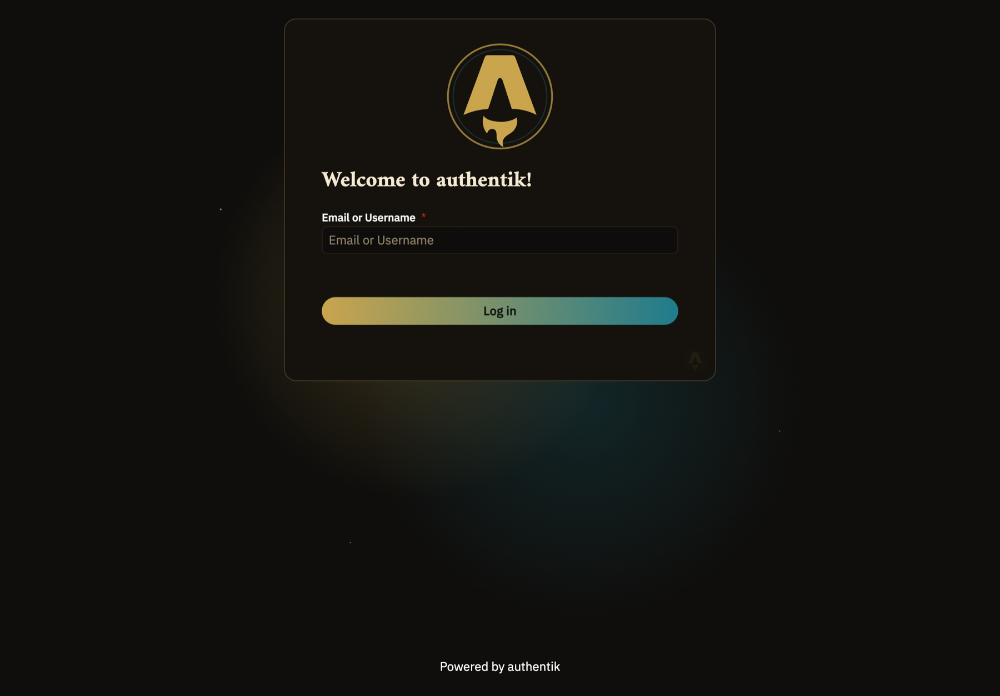
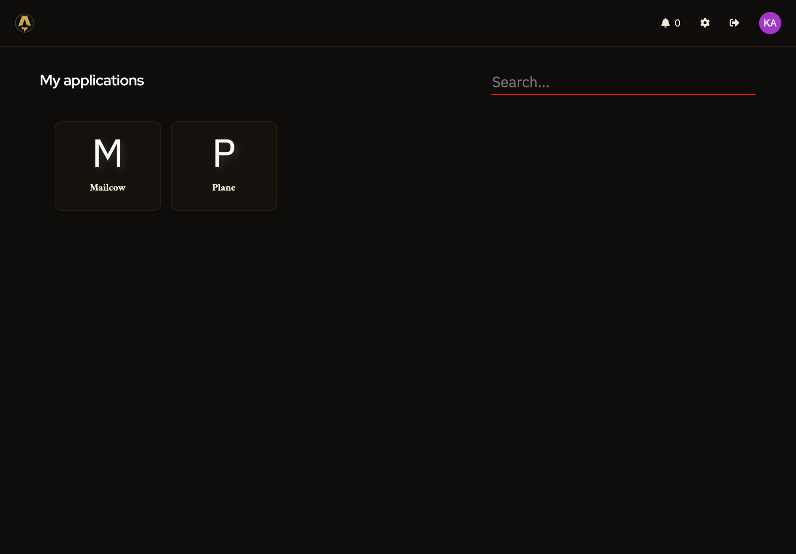
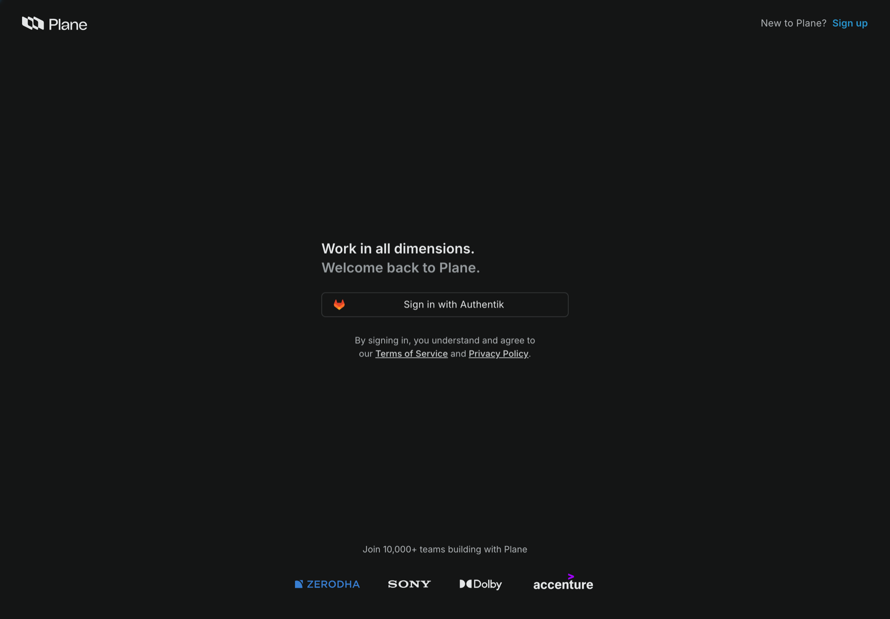
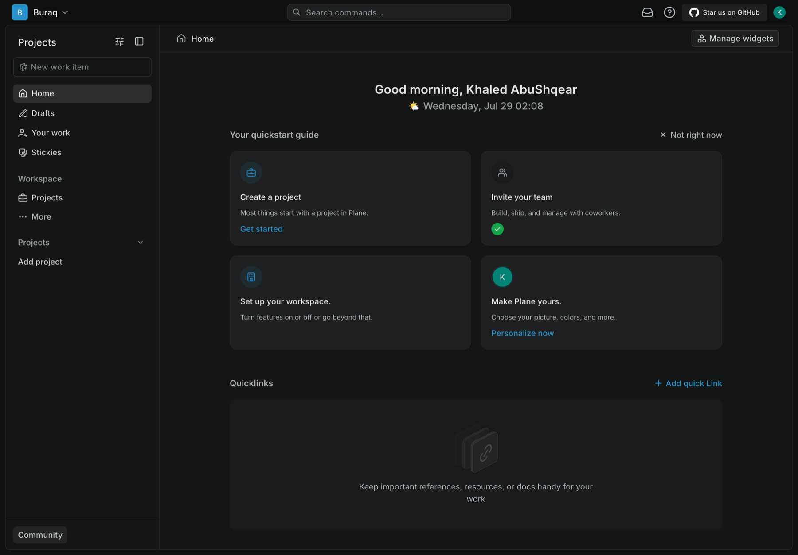
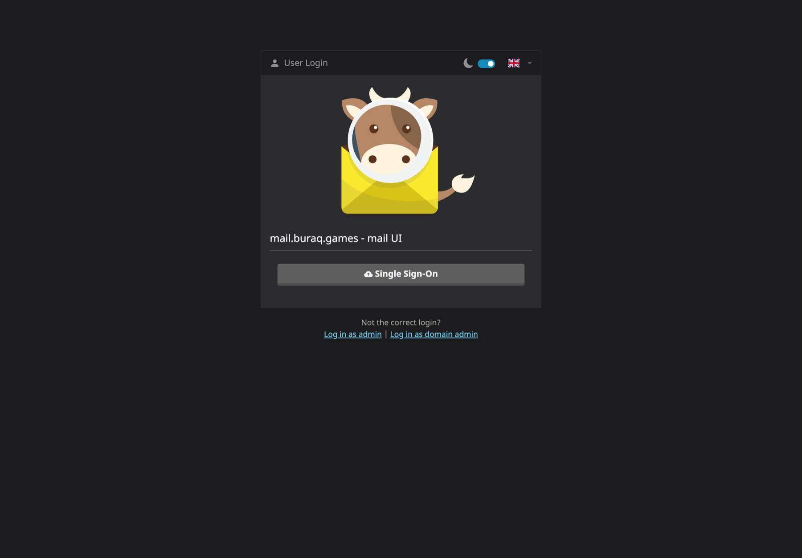

# Accessing Buraq's Tools

Buraq uses one login for everything — [Authentik](https://goauthentik.io/),
our identity provider. You'll get one account from an admin, and use it to
reach every tool below. There's no separate signup for Plane or Mailcow.

## Your account

An admin will send you:

- A login URL (`auth.buraq.games`)
- Your username/email (`firstname.lastname@buraq.games`)
- A one-time password

Treat that password as temporary — the first thing to do after logging in
is change it (see [Change your password](#change-your-password) below).

## Logging in

1. Go to **`https://auth.buraq.games`**.

    

2. Enter your `@buraq.games` email, then your password on the next screen.

3. You'll land on **My applications** — every tool you have access to
   shows up here as a tile.

    

That's it — one login, and anything you're allowed to use appears on this
page. If a tool you expect isn't listed, ask an admin to check your access.

## Opening Plane

Click the **Plane** tile (or go straight to `https://plane.buraq.games`).
You'll see a "Sign in with Authentik" button — click it, and since you're
already logged in to Authentik, it signs you straight into Plane with no
second password.

This lands you in the **Buraq** workspace:

From here, see [Using Plane](../production/using-plane.md) for how we
track sprints, tasks, and bugs day to day.

!!! note "First login only"
    If you land in an empty workspace that *isn't* called "Buraq," that's
    a known issue with a new account's very first login — message an
    admin and they'll move you into the right workspace.

## Opening Mailcow (email)

Click the **Mailcow** tile (or go to `https://mail.buraq.games`) and click
**Single Sign-On**.

Your `@buraq.games` mailbox is created automatically the first time you do
this — no separate request needed.

## Change your password

Once logged in to Authentik, go to your account settings and set a
password only you know. The one an admin sent you was generated for setup
only.

## If you're locked out

There's no self-service "forgot password" yet. Message an admin and
they'll reset it for you.
